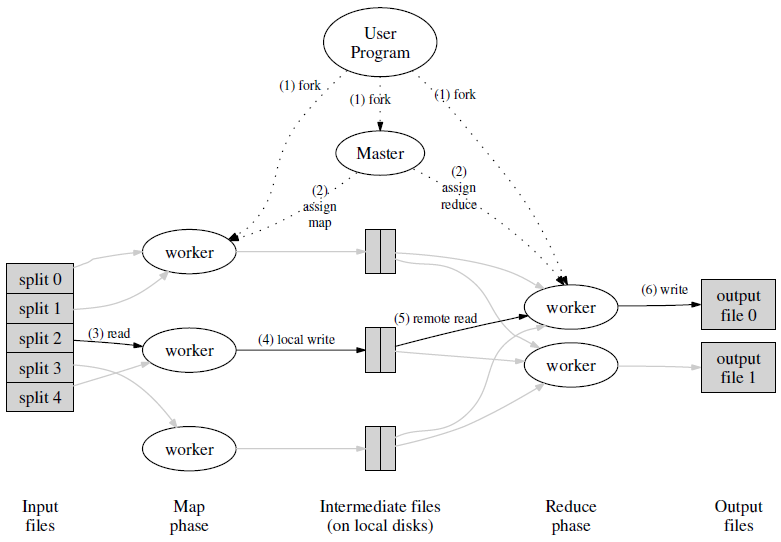
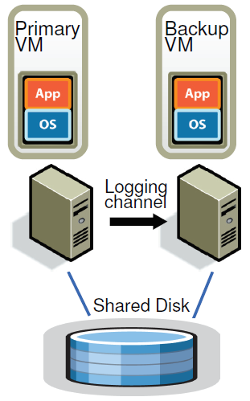

# 6.824: Distributed Systems Spring 2020
课程链接：http://nil.csail.mit.edu/6.824/2020/

GitHub链接：https://github.com/fkuner/6.824
## Lecture
### Lecture1 MapReduce
### Lecture2 RPC and Threads
1. I/O Concurrency
2. Parallelism
3. Convenience

race、coordination

web crawler execrise
### Lecture3 GFS

Master Data:
1. filename -> array of chunk handles
2. handle ->list of chunk servers
   ->version
   ->primary
   ->lease expiration
3. log, checkpoint

READ：
1. name, offset-master
2. M sends the chunk handle, list of servers which is cached by the client
3. client- CS and CS return data to the client

WRITE:

NO PRIMARY -> find up-to-date replicas -> pick primary, secondary -> increment v -> tells p, s -> master writes VA to disk

### Lecture4 Primary-Backup Replication

Failures:
1. fail-stop faults √
2. bugs ×

State transfer (memory)
Replicated State Machine (operation)

Non-def events:

1. Inputs-packet-data + interrupt
2. Weird instructions
3. Multicore

Log entry: instruction #, type, data

### Lecture5 Go Threads and Raft

condition variables:
```
mu.Lock()
// do something that might affect the condition
cond.Braodcast()
mu.Unlock()

---

mu.Lock()
while condition == false {
	cond.Wait()
}
// now condition is true, and we have the lock
mu.Unlock()
```

### Lecture6 Fault Tolerance Raft (1)

Leader -> 高效

ELECTION TIMER -> START ELECTION

term++, requestVote

### Lecture7 Fault Tolerance Raft (2)

## Papers
### MapReduce: Simplified Data Processing on Large Clusters 

### The Google File System 
### The Design of a Practical System for Fault-Tolerant Virtual Machines

通过主从复制，在不同的物理服务器上运行一个备份虚拟机，通过和主机执行相同的操作来保持同步。备份虚拟机被建模为确定性状态机，主从都执行相同的动作，
对于不确定性操作，还必须记录事件发生的确切指令。primary VM 接收的所有输入都会通过==logging channel==传输给backup VM，backup VM根据日志
信息进行replay，因此可以和primary VM有相同的执行，从而达到备份的目的。



### In Search of an Understandable Consensus Algorithm (Extended Version)


## Lab
### Lab1 MapReduce
### Lab2 Raft 